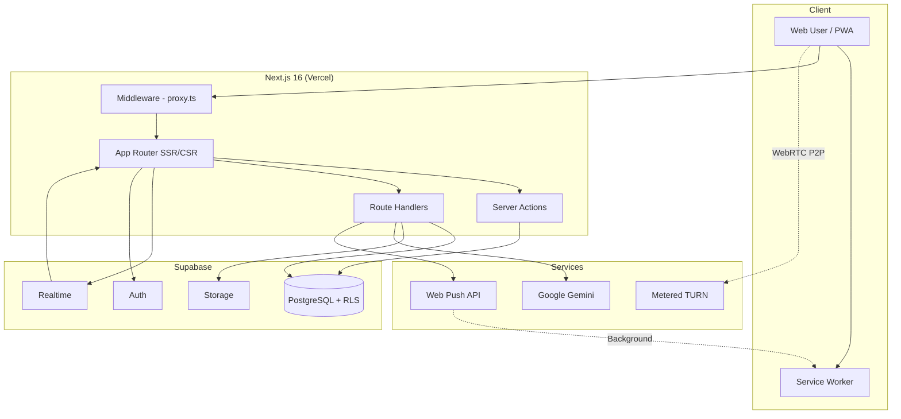

# Aphellium Platform v2.2


---

## Sobre Aphellium

**Aphellium** es una empresa ecuatoriana de tecnología e innovación enfocada en el desarrollo de soluciones de enfriamiento sostenible, integrando nanotecnología, inteligencia artificial y blockchain para la logística de floricultura y cadenas de frío. Nuestra misión es transformar la conservación de productos perecederos mediante tecnología de vanguardia, reduciendo la dependencia de refrigeración convencional.

**Aphellium Platform** es nuestro ecosistema digital completo que unifica:
- **Canal público** — Presencia corporativa, storytelling, noticias, proyectos e interacción con visitantes.
- **Canal operativo** — Portal administrativo interno para gestión de equipo, tareas, reuniones, comunicación y soporte.
- **PWA móvil** — Aplicación instalable en cualquier dispositivo con notificaciones push en tiempo real.

---

## Tabla de Contenidos

- [Sobre Aphellium](#sobre-aphellium)
- [ES - Plataforma Aphellium](#es---plataforma-aphellium)
  - [Descripción Ejecutiva](#descripción-ejecutiva)
  - [Novedades v2.2](#novedades-v22)
  - [Historial de Versiones](#historial-de-versiones)
  - [Capacidades de Negocio](#capacidades-de-negocio)
  - [Arquitectura Técnica](#arquitectura-técnica)
  - [Diagrama de Arquitectura](#diagrama-de-arquitectura)
  - [PWA y Notificaciones Push](#pwa-y-notificaciones-push)
  - [Modelo de Seguridad](#modelo-de-seguridad)
  - [Operación y Despliegue](#operación-y-despliegue)
  - [Variables de Entorno](#variables-de-entorno)
  - [Migraciones de Base de Datos](#migraciones-de-base-de-datos)
- [EN - Aphellium Platform](#en---aphellium-platform)
  - [Executive Summary](#executive-summary)
  - [What''s New in v2.2](#whats-new-in-v22)
  - [Version History](#version-history)
  - [Business Capabilities](#business-capabilities)
  - [Technical Architecture](#technical-architecture)
  - [Architecture Diagram](#architecture-diagram)
  - [PWA & Push Notifications](#pwa--push-notifications)
  - [Security Model](#security-model)
  - [Operations & Deployment](#operations--deployment)
  - [Environment Variables](#environment-variables)
  - [Database Migrations](#database-migrations)
- [ADR - Architecture Decision Records](#adr---architecture-decision-records)

---

## ES - Plataforma Aphellium

### Descripción Ejecutiva

Aphellium Platform es una solución full-stack de grado empresarial que opera en dos frentes estratégicos:

- **Canal público corporativo** para marca, storytelling interactivo, noticias, proyectos, formulario de contacto y atención al visitante mediante chat con IA.
- **Canal interno operativo** para gestión de usuarios, tareas, reuniones por videollamada, comunicación colaborativa en tiempo real y soporte al cliente.

La plataforma prioriza seguridad, trazabilidad y gobernanza de acceso mediante RBAC de 5 niveles y políticas RLS (Row Level Security) en más de 20 tablas de base de datos.

---

### Novedades v2.2

**PWA — Aplicación Móvil Instalable**

- **Service Worker** completo con estrategia cache-first para assets estáticos y network-first para contenido dinámico, con fallback a página offline personalizada.
- **Manifest.json** con configuración standalone, iconos en múltiples resoluciones (192px, 512px, maskable, Apple Touch Icon), shortcuts de navegación rápida y orientación optimizada para móvil.
- **Banner de instalación** nativo que aparece automáticamente después de unos segundos de uso, con botones de instalar/cerrar y persistencia de preferencia.
- **Notificaciones Push** con Web Push API y VAPID keys, funcionando incluso con la app cerrada o en segundo plano:
  - **Llamadas/videollamadas**: Notificación persistente con botones "Contestar" / "Rechazar" y vibración triple.
  - **Mensajes de soporte**: Notificación a todos los admins cuando un visitante inicia conversación o envía mensaje.
  - **Invitaciones a reuniones**: Push automático al invitar participantes, con enlace directo a la sala.
- **Prompt de permisos** inteligente que solicita activar notificaciones solo a usuarios autenticados, tras 8 segundos de permanencia.
- **Suscripción multi-dispositivo**: Cada usuario puede tener push activo en múltiples dispositivos simultáneamente, con limpieza automática de suscripciones expiradas.

**Rediseño Completo del Homepage**

- **Hero Section** con video de fondo y partículas de escarcha (FrostParticles) animadas por canvas, gradientes dinámicos y CTA prominente.
- **ImmersiveParallaxScene** — Sección de producto con efecto parallax 3D que responde al scroll, mostrando el eco-cooler desde múltiples ángulos.
- **Preview de equipo** con badges de sección y roles, cargado en tiempo real desde Supabase.
- **Secciones de noticias y proyectos** rediseñadas con layout alternado izquierda/derecha y cards premium.
- **Footer corporativo** con enlaces de navegación, redes sociales y branding.
- **Scroll Reveal animations** — Componente ScrollReveal con Intersection Observer para animaciones de entrada progresivas.

**Mejoras en Soporte y Chat**

- **Botón "Hablar con una persona"** rediseñado — ahora prominente con estilo emerald, icono de auriculares y tamaño ampliado para mejorar la tasa de escalación a agentes humanos.
- **Transcripción de IA** en vista de soporte renderizada como elemento `<details>` colapsable con mini burbujas de chat agente/cliente, evitando la distorsión visual anterior.
- **Notificaciones push a admins** cuando un visitante inicia conversación de soporte o envía mensajes.

**Fix de Inline Text Overrides**

- Eliminado el sistema de auto-indexing que causaba drift de overrides cuando el DOM cambiaba entre deploys. Los overrides ahora solo aplican a elementos con atributo `data-inline-edit-key` explícito.
- Limpieza de 95+ overrides "fantasma" de la base de datos que causaban superposición de texto de perfiles sobre la sección hero del homepage.
- AdminFloatingPanel prefija elementos auto-indexados con `_auto:` y los filtra antes de guardar.

---

### Historial de Versiones

<details>
<summary><strong>v2.1 — Security Hardening</strong></summary>

**Seguridad — Hardening Integral de Producción**

- **Security Headers**: Content-Security-Policy completo, HSTS (2 años + preload), X-Frame-Options, X-Content-Type-Options, Referrer-Policy, Permissions-Policy.
- **Rate Limiting**: Sistema por IP en endpoints críticos — Gemini (15/min), soporte (30/min), upload (10/min), link-preview (20/min), fetch-remote-image (30/min), profile (20/min).
- **Middleware Hardening**: Bloqueo de endpoints de debug en producción.
- **Cookie Security**: Cookies httpOnly, secure en producción, sameSite lax.
- **Stack Hiding**: Header X-Powered-By deshabilitado, source maps deshabilitados.
- **Body Size Limit**: Reducido de 50MB a 10MB.
- **robots.txt**: Bloqueo de crawlers en /admin/, /api/, /auth/.
- **Database RLS**: Row Level Security habilitado/forzado en 20+ tablas.
- **Revocación de permisos**: REVOKE EXECUTE en funciones públicas para rol anon.
- **Open Redirect** corregido en callback de autenticación.
- **XSS Prevention**: sanitizeHtml() en 8+ ubicaciones con dangerouslySetInnerHTML.
- **Validación de URLs**: Solo protocolos http/https en resolveArticleLink.
- **Correcciones de Dashboard**: Nombre real del usuario, layout con key={pathname}, sidebar con email, soporte restringido a admin, botones de eliminación funcionales, feature "última vez" en chat.

</details>

<details>
<summary><strong>v2.0 — Portal Admin Redesign + Proyectos Detalle</strong></summary>

**Portal Administrativo — Rediseño Completo UX/UI**

- Nuevo Layout con sidebar agrupado por secciones, badges de rol, navegación mobile con bottom nav y pills.
- Dashboard con tarjetas clicables, saludo personalizado, indicador de mensajes nuevos.
- Tablas profesionales para noticias/proyectos con headers uppercase y diagnóstico mejorado.
- Centro de Mensajes con tabs Correos/Soporte, búsqueda mejorada, cards con transiciones.
- Gestión de Usuarios con formulario renovado, drag & drop para orden del equipo.
- Design System Unificado: bordes white/[0.06], fondos white/[0.02], inputs white/[0.03].

**Páginas de Proyectos Públicas**

- Nueva página blog-style /proyectos/[id] con hero, métricas, galería, sidebar sticky.
- Cards de proyectos en home enlazan directamente a detalle individual.

</details>

---

### Capacidades de Negocio

1. **Presencia corporativa digital**
   - Home con video hero, parallax 3D, partículas animadas y diseño premium.
   - Páginas institucionales: nosotros, noticias, proyectos y contacto.
   - Contenido bilingüe automático (ES/EN) con detección de idioma.
   - Páginas de detalle individual para noticias y proyectos (blog-style).
   - SEO optimizado con metadatos Open Graph y robots.txt.

2. **Gestión administrativa**
   - Operación editorial de noticias/proyectos con editor de texto enriquecido (imágenes, embeds, links).
   - Gestión de cuentas, roles (5 niveles) y orden de presentación del equipo (drag & drop).
   - Panel de edición inline de textos del sitio público.
   - Diagnóstico de publicaciones (traducciones, enlaces, embeds).

3. **Planificación operativa**
   - Ciclo de vida de tareas: pendiente → en progreso → completada / cancelada / postergada.
   - Asignaciones, confirmación de participación, comentarios y adjuntos (hasta 50MB).
   - Registro de actividad para auditoría operacional.

4. **Reuniones y videollamadas**
   - Creación de salas con metadatos, agenda y configuración de acceso.
   - Invitaciones en tiempo real con notificaciones push.
   - WebRTC peer-to-peer con STUN/TURN, anotaciones de pantalla, chat en sala, reacciones y mano levantada.
   - Soporte multi-participante con reconexión automática.

5. **Comunicación en tiempo real**
   - Chat directo 1:1 con indicador "última vez conectado".
   - Grupos manuales (admin/coordinador) y grupos auto-generados por tarea.
   - Soporte al cliente con chat en vivo y escalación de IA a humano.
   - Adjuntos en chat con preview y almacenamiento en Supabase Storage.
   - Notificaciones push para mensajes y soporte.

6. **Inteligencia Artificial**
   - Base de conocimiento con documentos importados.
   - Chat público asistido por IA (Google Gemini) con contexto de la empresa.
   - Marcador [ESCALATE] para transferencia automática a agente humano.

7. **PWA — Aplicación Móvil**
   - Instalable en Android e iOS directamente desde el navegador.
   - Modo standalone (sin barra de navegación del browser).
   - Notificaciones push en segundo plano para llamadas, mensajes y soporte.
   - Página offline personalizada con botón de reconexión.
   - Cache inteligente de assets para carga rápida.

### Arquitectura Técnica

| Capa | Tecnología | Propósito |
|------|-----------|-----------|
| **Frontend/SSR** | Next.js 16, React 19, TypeScript 5 | Renderizado híbrido SSR/CSR con App Router |
| **Estilo** | Tailwind CSS 4, Framer Motion | Design system con animaciones fluidas |
| **Base de datos** | Supabase (PostgreSQL 15) | Auth, Storage, Realtime, RLS |
| **IA** | Google Gemini API | Chat asistido con contexto empresarial |
| **Video** | WebRTC + STUN/TURN (Metered.ca) | Videollamadas P2P con fallback relay |
| **PWA** | Service Worker + Web Push API | Instalabilidad y push notifications |
| **Despliegue** | Vercel | Edge network, serverless functions |

**Patrones de backend:**

- **Server Actions** para mutaciones de negocio (formularios, CRUD, invitaciones).
- **Route Handlers** para APIs REST (push, chat, upload, preview).
- **Middleware (proxy.ts)** para headers de seguridad, rate-limiting y redirecciones.
- **Utilidades centralizadas** en `utils/` para auth, roles, i18n, rate-limit y clientes Supabase.

**Dominios principales:**

| Dominio | Módulos |
|---------|---------|
| Contenido | Noticias, Proyectos, Editor Enriquecido, Inline Overrides |
| Operaciones | Tareas, Asignaciones, Comentarios, Adjuntos, Actividad |
| Comunicación | Chat Directo, Salas, Soporte con IA, Videollamadas WebRTC |
| Identidad | Auth, Perfil, Roles RBAC (5 niveles), Permisos Granulares |
| IA | Base de Conocimiento, Chat Gemini, Escalación Automática |
| PWA | Service Worker, Push Notifications, Offline Support |

### Diagrama de Arquitectura


### PWA y Notificaciones Push

La plataforma funciona como una Progressive Web App completa:

**Instalación:**
- En **Android (Chrome)**: Aparece banner "Instalar Aphellium" automáticamente o desde menú → "Instalar aplicación".
- En **iOS (Safari)**: Compartir → "Añadir a pantalla de inicio".
- Se abre como app independiente en modo standalone (sin barra del navegador).

**Notificaciones Push:**
- Funcionan con la app cerrada o el navegador en segundo plano.
- Tipos de notificación:
  - `call` — Invitación a videollamada con botones Contestar/Rechazar y vibración prolongada.
  - `support` — Nuevo mensaje o conversación de soporte (notifica a admins).
  - `message` — Mensaje directo o de grupo.
- Al hacer clic en la notificación, navega directamente a la sección correspondiente.
- Multi-dispositivo: un usuario puede recibir notificaciones en todos sus dispositivos registrados.

**Offline:**
- Service Worker con caché de assets estáticos (shell de la app).
- Página offline personalizada con branding de Aphellium y botón "Reintentar".
- Strategy network-first para contenido dinámico con fallback a caché.

### Modelo de Seguridad

La seguridad es un pilar fundamental de la plataforma, implementada en múltiples capas:

**Autenticación y Autorización:**
- **RBAC** de 5 niveles: admin → coordinador → editor → viewer → visitante.
- Autorización obligatoria en Server Actions y Route Handlers.
- Permisos granulares por módulo (view_mensajes, edit_tareas, etc.).

**Base de Datos:**
- **RLS** habilitado y forzado en 20+ tablas con políticas granulares.
- REVOKE EXECUTE en funciones públicas para rol anon.
- Service role únicamente en contexto server-side controlado.

**Transporte y Headers:**
- Content-Security-Policy estricto (script-src, img-src, connect-src controlados).
- HSTS con max-age 2 años y preload.
- X-Frame-Options DENY, X-Content-Type-Options nosniff.
- Referrer-Policy strict-origin-when-cross-origin.
- Permissions-Policy restrictivo (geolocation=(), camera=(self), microphone=(self)).
- X-Powered-By deshabilitado.

**Protección de Endpoints:**
- Rate Limiting por IP en todos los endpoints críticos.
- Body size limit 10MB.
- Endpoints de debug bloqueados en producción.
- robots.txt bloqueando crawlers en /admin/, /api/, /auth/.

**Sanitización y Validación:**
- **XSS**: sanitizeHtml() en todos los dangerouslySetInnerHTML.
- **Open Redirect**: Validación de parámetro next en auth callback.
- **URL Validation**: Solo protocolos http/https permitidos.
- **MIME Whitelist**: Validación de tipos de archivo en uploads.
- **UUID Validation**: Validación de UUIDs en llamadas directas.

**Cookies:**
- httpOnly, secure en producción, sameSite lax.
- Source maps deshabilitados en producción.

### Operación y Despliegue

**Desarrollo local:**

```bash
# Instalar dependencias
npm install

# Iniciar servidor de desarrollo
npm run dev
# → http://localhost:3000
```

**Build de producción:**

```bash
npm run build
npm run start
```

**Despliegue:**

El despliegue se realiza en **Vercel** mediante CLI o push a la rama `main`:

```bash
# Deploy a producción
npx vercel --prod
```

**Checklist de salida a producción:**

- [ ] Variables de entorno completas y validadas en Vercel Dashboard.
- [ ] Migraciones SQL aplicadas en orden en Supabase SQL Editor.
- [ ] Buckets de Storage (chat-files, meeting-files) con políticas correctas.
- [ ] VAPID keys generadas y configuradas para push notifications.
- [ ] RLS verificado por rol en todas las tablas.
- [ ] CSP y Security Headers verificados con securityheaders.com.

### Variables de Entorno

**Requeridas:**

| Variable | Descripción | Ejemplo |
|----------|-------------|---------|
| `NEXT_PUBLIC_SUPABASE_URL` | URL del proyecto Supabase | `https://xxx.supabase.co` |
| `NEXT_PUBLIC_SUPABASE_ANON_KEY` | Clave pública anon de Supabase | `eyJhbG...` |
| `SUPABASE_SERVICE_ROLE_KEY` | Clave de service role (solo server-side) | `sb_secret_...` |
| `GEMINI_API_KEY` | API key de Google Gemini para chat IA | `AIza...` |

**Push Notifications (requeridas para PWA):**

| Variable | Descripción |
|----------|-------------|
| `NEXT_PUBLIC_VAPID_PUBLIC_KEY` | Clave pública VAPID (visible en cliente) |
| `VAPID_PRIVATE_KEY` | Clave privada VAPID (solo server-side) |
| `VAPID_SUBJECT` | Email de contacto para VAPID (mailto:...) |

**Opcionales:**

| Variable | Descripción |
|----------|-------------|
| `DATABASE_URL` | Conexión directa a PostgreSQL (scripts/mantenimiento) |
| `TRANSLATE_API_URL` | Endpoint de traducción automática |
| `METERED_DOMAIN` | Dominio de Metered.ca para TURN servers |
| `METERED_SECRET_KEY` | Secret key de Metered.ca para credenciales TURN |

> **Nota**: Las variables se configuran en `.env.local` para desarrollo y en Vercel Dashboard para producción. Ver `.env.example` como template.

### Migraciones de Base de Datos

Ejecutar en Supabase SQL Editor en orden secuencial:

| # | Archivo | Descripción |
|---|---------|-------------|
| 1 | `001_chat_messages.sql` | Sistema de mensajería y chat |
| 2 | `002_tasks_system.sql` | Sistema de tareas con asignaciones |
| 3 | `003_fix_rls_recursion.sql` | Fix de recursión en políticas RLS |
| 4 | `004_group_chat_and_task_gate.sql` | Chat grupal y gate de tareas |
| 5 | `004_support_and_knowledge.sql` | Soporte y base de conocimiento |
| 6 | `005_backfill_group_chat_tables.sql` | Backfill de tablas de chat grupal |
| 7 | `006_meetings_system.sql` | Sistema de reuniones |
| 8 | `007_webrtc_signals.sql` | Señalización WebRTC |
| 9 | `008_meeting_invitations_realtime.sql` | Invitaciones en tiempo real |
| 10 | `009_profiles_team_order.sql` | Orden del equipo en profiles |
| 11 | `010_profiles_team_section.sql` | Sección del equipo en profiles |
| 12 | `011_meeting_enhancements.sql` | Mejoras de reuniones |
| 13 | `012_profiles_last_seen.sql` | Última conexión en profiles |
| 14 | `013_security_hardening.sql` | Hardening de seguridad y RLS |
| 15 | `014_meeting_invitations_replica_identity.sql` | Replica identity para invitaciones |
| 16 | `014_webrtc_signals_delete_policy.sql` | Política de delete para señales WebRTC |
| 17 | `015_meeting_access_code.sql` | Códigos de acceso para reuniones |
| 18 | `016_push_subscriptions.sql` | Suscripciones push para PWA |

---

## EN - Aphellium Platform

### Executive Summary

Aphellium Platform is an enterprise-grade full-stack web solution operating across two strategic channels:

- **Public-facing** brand experience with interactive storytelling, news, projects, contact forms, and AI-powered visitor chat.
- **Internal operations** workspace for user management, task orchestration, video meetings, real-time collaboration, and customer support.

The platform is built on secure-by-default principles using 5-level RBAC and database-level RLS enforcement across 20+ tables.

---

### What''s New in v2.2

**PWA — Installable Mobile Application**

- **Full Service Worker** with cache-first strategy for static assets and network-first for dynamic content, with offline fallback page.
- **Manifest.json** with standalone display, multi-resolution icons (192px, 512px, maskable, Apple Touch Icon), navigation shortcuts, and mobile-optimized orientation.
- **Native install banner** appearing automatically after a few seconds of use, with install/dismiss buttons and preference persistence.
- **Push Notifications** via Web Push API with VAPID keys, working even when the app is closed or in background:
  - **Calls/video calls**: Persistent notification with "Answer" / "Decline" buttons and triple vibration.
  - **Support messages**: All admins notified when a visitor starts a conversation or sends a message.
  - **Meeting invitations**: Automatic push when inviting participants, with direct link to the meeting room.
- **Smart permission prompt** that only requests notification activation for authenticated users, after 8 seconds of page time.
- **Multi-device subscription**: Each user can have active push on multiple devices simultaneously, with automatic cleanup of expired subscriptions.

**Complete Homepage Redesign**

- **Hero Section** with background video and animated frost particles (FrostParticles) via canvas, dynamic gradients, and prominent CTA.
- **ImmersiveParallaxScene** — Product section with 3D parallax effect responding to scroll, showing the eco-cooler from multiple angles.
- **Team preview** with section badges and roles, loaded in real-time from Supabase.
- **News and projects sections** redesigned with alternating left/right layout and premium cards.
- **Corporate footer** with navigation links, social media, and branding.
- **Scroll Reveal animations** — ScrollReveal component with Intersection Observer for progressive entrance animations.

**Support & Chat Improvements**

- **"Talk to a person" button** redesigned — now prominent with emerald styling, headset icon, and increased size to improve human escalation rate.
- **AI transcript** in support view rendered as collapsible `<details>` element with mini agent/client chat bubbles.
- **Push notifications to admins** when a visitor starts a support conversation or sends messages.

**Inline Text Overrides Fix**

- Removed auto-indexing system that caused override drift when DOM changed between deploys. Overrides now only apply to elements with explicit `data-inline-edit-key` attribute.
- Cleaned 95+ phantom overrides from the database that caused profile text overlapping the hero section.

---

### Version History

<details>
<summary><strong>v2.1 — Security Hardening</strong></summary>

- Complete Security Headers (CSP, HSTS 2yr + preload, X-Frame-Options, Permissions-Policy).
- Per-IP Rate Limiting on all critical endpoints.
- Middleware debug endpoint blocking in production.
- Cookie hardening (httpOnly, secure, sameSite lax).
- Stack hiding (X-Powered-By disabled, source maps disabled).
- Body size limit reduced to 10MB.
- robots.txt for crawler blocking on sensitive routes.
- RLS enabled and enforced on 20+ tables.
- Open Redirect fix in auth callback.
- XSS prevention with sanitizeHtml() in 8+ locations.
- URL validation (http/https only).
- Admin portal fixes: real name display, layout key, support restriction, delete buttons, "last seen" feature.

</details>

<details>
<summary><strong>v2.0 — Admin Portal Redesign + Project Detail Pages</strong></summary>

- Complete admin portal UX/UI overhaul with grouped sidebar, role badges, mobile bottom nav.
- Redesigned dashboard with clickable stat cards and personalized greeting.
- Professional tables, message center with tabs, drag & drop team ordering.
- Unified Design System (white/[0.06] borders, white/[0.02] backgrounds, cyan/green accents).
- New blog-style /proyectos/[id] detail pages with hero, metrics, gallery, sticky sidebar.
- Homepage project cards linking to individual detail pages.

</details>

---

### Business Capabilities

1. **Corporate digital presence**
   - Homepage with video hero, 3D parallax, animated particles, and premium design.
   - Institutional pages: about us, news, projects, and contact.
   - Automatic bilingual content (ES/EN) with language detection.
   - Individual detail pages for news and projects (blog-style).
   - SEO optimized with Open Graph metadata and robots.txt.

2. **Administrative operations**
   - News and project lifecycle management with rich text editor (images, embeds, links).
   - User and role administration (5 levels) with team ordering (drag & drop).
   - Inline text editing panel for public site copy.
   - Publication diagnostics (translations, links, embeds).

3. **Task orchestration**
   - Task lifecycle: pending → in progress → completed / cancelled / postponed.
   - Assignments, acceptance confirmation, comments, and attachments (up to 50MB).
   - Activity timeline for operational audit.

4. **Meetings & video calls**
   - Meeting room creation with metadata, agenda, and access configuration.
   - Real-time invitations with push notifications.
   - WebRTC peer-to-peer with STUN/TURN, screen annotations, in-room chat, reactions, and hand raising.
   - Multi-participant support with automatic reconnection.

5. **Real-time communication**
   - 1:1 direct messaging with "last seen" indicator.
   - Manual group rooms (admin/coordinator) and auto-generated task rooms.
   - Customer support with live chat and AI-to-human escalation.
   - Chat attachments with preview and Supabase Storage.
   - Push notifications for messages and support.

6. **Artificial Intelligence**
   - Knowledge base with imported documents.
   - Public AI-assisted chat (Google Gemini) with company context.
   - [ESCALATE] marker for automatic human agent transfer.

7. **PWA — Mobile Application**
   - Installable on Android and iOS directly from the browser.
   - Standalone mode (no browser navigation bar).
   - Background push notifications for calls, messages, and support.
   - Custom offline page with reconnection button.
   - Smart asset caching for fast loading.

### Technical Architecture

| Layer | Technology | Purpose |
|-------|-----------|---------|
| **Frontend/SSR** | Next.js 16, React 19, TypeScript 5 | Hybrid SSR/CSR rendering with App Router |
| **Styling** | Tailwind CSS 4, Framer Motion | Design system with fluid animations |
| **Database** | Supabase (PostgreSQL 15) | Auth, Storage, Realtime, RLS |
| **AI** | Google Gemini API | Business-context assisted chat |
| **Video** | WebRTC + STUN/TURN (Metered.ca) | P2P video calls with relay fallback |
| **PWA** | Service Worker + Web Push API | Installability and push notifications |
| **Deployment** | Vercel | Edge network, serverless functions |

**Backend patterns:**

- **Server Actions** for domain mutations (forms, CRUD, invitations).
- **Route Handlers** for REST APIs (push, chat, upload, preview).
- **Middleware (proxy.ts)** for security headers, rate-limiting, and redirects.
- **Centralized utilities** in `utils/` for auth, roles, i18n, rate-limit, and Supabase clients.

**Primary domains:**

| Domain | Modules |
|--------|---------|
| Content | News, Projects, Rich Text Editor, Inline Overrides |
| Operations | Tasks, Assignments, Comments, Attachments, Activity |
| Communication | Direct Chat, Rooms, AI-Powered Support, WebRTC Video Calls |
| Identity | Auth, Profile, RBAC Governance (5 levels), Granular Permissions |
| AI | Knowledge Base, Gemini Chat, Automatic Escalation |
| PWA | Service Worker, Push Notifications, Offline Support |

### Architecture Diagram



### PWA & Push Notifications

The platform works as a complete Progressive Web App:

**Installation:**
- **Android (Chrome)**: "Install Aphellium" banner appears automatically, or via menu → "Install app".
- **iOS (Safari)**: Share → "Add to Home Screen".
- Opens as a standalone app (no browser address bar).

**Push Notifications:**
- Work with the app closed or browser in background.
- Notification types:
  - `call` — Video call invitation with Answer/Decline buttons and extended vibration.
  - `support` — New support message or conversation (notifies admins).
  - `message` — Direct or group message.
- Clicking the notification navigates directly to the relevant section.
- Multi-device: a user can receive notifications on all registered devices.

**Offline:**
- Service Worker with static asset caching (app shell).
- Custom offline page with Aphellium branding and "Retry" button.
- Network-first strategy for dynamic content with cache fallback.

### Security Model

Security is a cornerstone of the platform, implemented across multiple layers:

**Authentication & Authorization:**
- **5-level RBAC**: admin → coordinator → editor → viewer → visitor.
- Mandatory authorization in Server Actions and Route Handlers.
- Granular per-module permissions.

**Database:**
- **RLS** enabled and enforced on 20+ tables with granular policies.
- REVOKE EXECUTE on public functions for anon role.
- Service role credentials only in trusted server contexts.

**Transport & Headers:**
- Strict Content-Security-Policy (script-src, img-src, connect-src controlled).
- HSTS with 2-year max-age and preload.
- X-Frame-Options DENY, X-Content-Type-Options nosniff.
- Restrictive Permissions-Policy.
- X-Powered-By disabled.

**Endpoint Protection:**
- Per-IP Rate Limiting on all critical endpoints.
- 10MB body size limit.
- Debug endpoints blocked in production.
- robots.txt blocking crawlers on /admin/, /api/, /auth/.

**Sanitization & Validation:**
- **XSS**: sanitizeHtml() on all dangerouslySetInnerHTML.
- **Open Redirect**: Auth callback next parameter validation.
- **URL Validation**: http/https protocols only.
- **MIME Whitelist**: File type validation on uploads.
- **UUID Validation**: UUID validation on direct calls.

**Cookies:**
- httpOnly, secure in production, sameSite lax.
- Source maps disabled in production.

### Operations & Deployment

**Local development:**

```bash
npm install
npm run dev
```

**Production build:**

```bash
npm run build
npm run start
```

**Deployment (Vercel):**

```bash
npx vercel --prod
```

**Production readiness checklist:**

- [ ] Environment variables configured in Vercel Dashboard.
- [ ] SQL migrations applied sequentially in Supabase SQL Editor.
- [ ] Storage buckets (chat-files, meeting-files) with correct policies.
- [ ] VAPID keys generated and configured for push notifications.
- [ ] RLS verified by role across all tables.
- [ ] CSP and Security Headers verified with securityheaders.com.

### Environment Variables

**Required:**

| Variable | Description | Example |
|----------|-------------|---------|
| `NEXT_PUBLIC_SUPABASE_URL` | Supabase project URL | `https://xxx.supabase.co` |
| `NEXT_PUBLIC_SUPABASE_ANON_KEY` | Supabase public anon key | `eyJhbG...` |
| `SUPABASE_SERVICE_ROLE_KEY` | Service role key (server-side only) | `sb_secret_...` |
| `GEMINI_API_KEY` | Google Gemini API key for AI chat | `AIza...` |

**Push Notifications (required for PWA):**

| Variable | Description |
|----------|-------------|
| `NEXT_PUBLIC_VAPID_PUBLIC_KEY` | VAPID public key (visible on client) |
| `VAPID_PRIVATE_KEY` | VAPID private key (server-side only) |
| `VAPID_SUBJECT` | VAPID contact email (mailto:...) |

**Optional:**

| Variable | Description |
|----------|-------------|
| `DATABASE_URL` | Direct PostgreSQL connection (scripts/maintenance) |
| `TRANSLATE_API_URL` | Auto-translation endpoint |
| `METERED_DOMAIN` | Metered.ca domain for TURN servers |
| `METERED_SECRET_KEY` | Metered.ca secret key for TURN credentials |

> **Note**: Variables are set in `.env.local` for development and in Vercel Dashboard for production. See `.env.example` as template.

### Database Migrations

Run sequentially in Supabase SQL Editor:

| # | File | Description |
|---|------|-------------|
| 1 | `001_chat_messages.sql` | Messaging and chat system |
| 2 | `002_tasks_system.sql` | Task system with assignments |
| 3 | `003_fix_rls_recursion.sql` | RLS policy recursion fix |
| 4 | `004_group_chat_and_task_gate.sql` | Group chat and task gates |
| 5 | `004_support_and_knowledge.sql` | Support and knowledge base |
| 6 | `005_backfill_group_chat_tables.sql` | Group chat table backfill |
| 7 | `006_meetings_system.sql` | Meeting system |
| 8 | `007_webrtc_signals.sql` | WebRTC signaling |
| 9 | `008_meeting_invitations_realtime.sql` | Real-time invitations |
| 10 | `009_profiles_team_order.sql` | Team order in profiles |
| 11 | `010_profiles_team_section.sql` | Team section in profiles |
| 12 | `011_meeting_enhancements.sql` | Meeting enhancements |
| 13 | `012_profiles_last_seen.sql` | Last seen on profiles |
| 14 | `013_security_hardening.sql` | Security hardening and RLS |
| 15 | `014_meeting_invitations_replica_identity.sql` | Invitation replica identity |
| 16 | `014_webrtc_signals_delete_policy.sql` | WebRTC signals delete policy |
| 17 | `015_meeting_access_code.sql` | Meeting access codes |
| 18 | `016_push_subscriptions.sql` | Push subscriptions for PWA |

---

## ADR - Architecture Decision Records

**ADR-001**: Next.js App Router selected for unified SSR + server-side business logic with React Server Components.

**ADR-002**: Supabase chosen as backend platform to consolidate Auth, Postgres, Storage, and Realtime in a single managed service.

**ADR-003**: RBAC (5 levels) + RLS adopted to enforce least privilege at both application and database layers.

**ADR-004**: Task collaboration is acceptance-gated to prevent unauthorized interaction in operational workflows.

**ADR-005**: Group chat model supports both manual rooms and task-linked automatic rooms for operational coordination.

**ADR-006**: WebRTC selected for peer-to-peer video calls to minimize latency and server costs, with TURN fallback for restrictive NATs.

**ADR-007**: Google Gemini integrated for AI-assisted chat with knowledge base context and automatic human escalation.

**ADR-008**: PWA with Service Worker and Web Push API selected over native app development for cross-platform installability without app store distribution overhead.

**ADR-009**: VAPID-based push notifications chosen for server-initiated real-time alerts (calls, messages, support) with multi-device support and automatic stale subscription cleanup.
