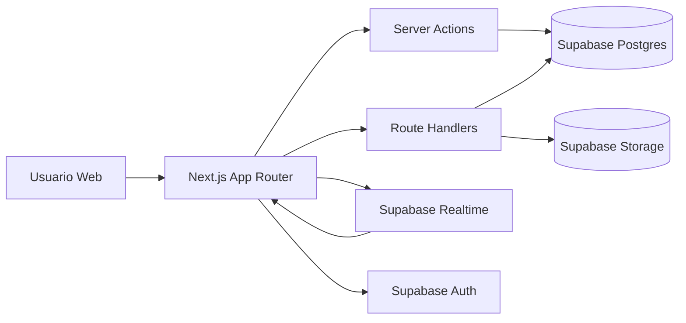
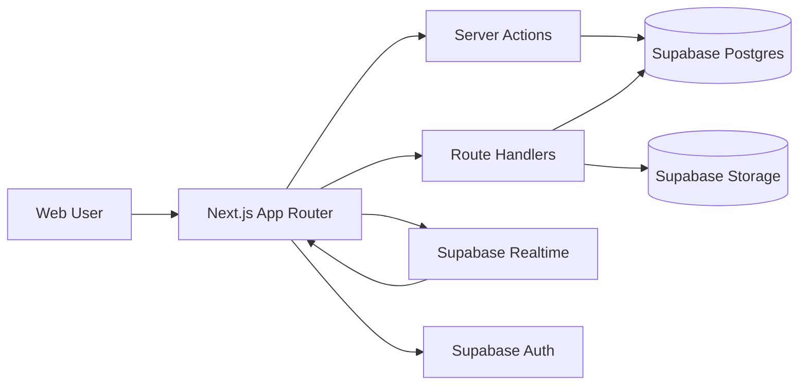

# Aphellium Platform


Enterprise-grade bilingual documentation (ES/EN) for the Aphellium web and operations platform.

---

## Table of Contents

- [ES - Plataforma Aphellium](#es---plataforma-aphellium)
	- [Descripcion Ejecutiva](#descripcion-ejecutiva)
	- [Capacidades de Negocio](#capacidades-de-negocio)
	- [Arquitectura Tecnica](#arquitectura-tecnica)
	- [Diagrama de Arquitectura](#diagrama-de-arquitectura)
	- [Modelo de Seguridad](#modelo-de-seguridad)
	- [Operacion y Despliegue](#operacion-y-despliegue)
	- [Variables de Entorno](#variables-de-entorno)
	- [Migraciones](#migraciones)
- [EN - Aphellium Platform](#en---aphellium-platform)
	- [Executive Summary](#executive-summary)
	- [Business Capabilities](#business-capabilities)
	- [Technical Architecture](#technical-architecture)
	- [Architecture Diagram](#architecture-diagram)
	- [Security Model](#security-model)
	- [Operations and Deployment](#operations-and-deployment)
	- [Environment Variables](#environment-variables)
	- [Migrations](#migrations-1)
- [ADR - Architecture Decision Records](#adr---architecture-decision-records)

---

## ES - Plataforma Aphellium

### Descripcion Ejecutiva

Aphellium Platform es una solucion web integral orientada a dos frentes:

- Canal publico corporativo para marca, storytelling, noticias y proyectos.
- Canal interno operativo para gestion de usuarios, tareas y comunicacion colaborativa.

La plataforma prioriza seguridad, trazabilidad y gobernanza de acceso mediante RBAC y politicas RLS en base de datos.

### Capacidades de Negocio

1. Presencia corporativa digital
- Home, nosotros, noticias, proyectos y contacto.
- Experiencia visual multimedia y contenido bilingue.

2. Gestion administrativa
- Operacion editorial de noticias/proyectos.
- Gestion de cuentas y roles.
- Configuracion y perfil de usuario.

3. Planificacion operativa
- Ciclo de vida de tareas: pendiente, en progreso, completada, cancelada, postergada.
- Asignaciones, confirmacion de participacion, comentarios y adjuntos.
- Registro de actividad para auditoria operacional.

4. Comunicacion interna en tiempo real
- Chat directo 1:1.
- Grupos manuales (admin/coordinador).
- Grupos de tarea autogenerados tras aceptacion.

### Arquitectura Tecnica

- Frontend/SSR: Next.js 16, React 19, TypeScript.
- UI/UX: Tailwind CSS 4, framer-motion, lucide-react.
- Backend platform: Supabase (Auth, Postgres, Storage, Realtime).
- Patrones de backend:
	- Server Actions para mutaciones de negocio.
	- Route Handlers para APIs especificas.
	- Utilidades centralizadas en capa utils para auth/roles/i18n/clientes.

Dominios principales:

- Contenido: noticias, proyectos.
- Operaciones: tareas, asignaciones, comentarios, adjuntos, actividad.
- Comunicacion: chat directo y chat por salas.
- Identidad: auth, perfil, roles y permisos.

### Diagrama de Arquitectura



### Modelo de Seguridad

- RBAC por rol: admin, coordinador, editor, viewer, visitante.
- Autorizacion obligatoria en acciones sensibles de servidor.
- RLS habilitado en tablas operativas y de colaboracion.
- Uso de service role unicamente en contexto server-side controlado.
- Variables sensibles excluidas del control de versiones.

### Operacion y Despliegue

Desarrollo local:

```bash
npm install
npm run dev
```

Build y ejecucion:

```bash
npm run build
npm run start
```

Despliegue recomendado: Vercel.

Checklist de salida a produccion:

- Variables de entorno completas y validadas.
- Migraciones SQL aplicadas en orden.
- Buckets/politicas de storage verificadas.
- Pruebas de permisos por rol y RLS.

### Variables de Entorno

Requeridas:

- NEXT_PUBLIC_SUPABASE_URL
- NEXT_PUBLIC_SUPABASE_ANON_KEY
- SUPABASE_SERVICE_ROLE_KEY

Opcionales:

- TRANSLATE_API_URL
- DATABASE_URL

### Migraciones

Ejecutar en orden:

1. migrations/001_chat_messages.sql
2. migrations/002_tasks_system.sql
3. migrations/003_fix_rls_recursion.sql
4. migrations/004_group_chat_and_task_gate.sql

---

## EN - Aphellium Platform

### Executive Summary

Aphellium Platform is a full-stack web solution designed for two strategic channels:

- Public-facing brand and content experience.
- Internal operations workspace for administration, task orchestration, and communication.

The platform is designed around secure-by-default principles using RBAC and database-level RLS enforcement.

### Business Capabilities

1. Corporate digital presence
- Public pages for brand, team, news, projects, and contact.
- Bilingual content support and media-driven UX.

2. Administrative operations
- News and project lifecycle management.
- User and role administration.
- Profile and platform settings workflows.

3. Task orchestration
- Task lifecycle management with priorities and due dates.
- Assignment, acceptance confirmation, threaded collaboration.
- Attachments and activity timeline for operational traceability.

4. Real-time internal communication
- 1:1 direct messaging.
- Manual group rooms (admin/coordinator).
- Auto-linked task rooms after assignment acceptance.

### Technical Architecture

- Frontend/SSR: Next.js 16, React 19, TypeScript.
- UI/UX: Tailwind CSS 4, framer-motion, lucide-react.
- Backend platform: Supabase (Auth, Postgres, Storage, Realtime).
- Backend patterns:
	- Server Actions for domain mutations.
	- Route Handlers for scoped backend APIs.
	- Centralized utility layer for auth/roles/i18n/clients.

Primary domains:

- Content: news and projects.
- Operations: tasks, assignments, comments, attachments, activity.
- Communication: direct and room-based chat.
- Identity: authentication, profile, role governance.

### Architecture Diagram



### Security Model

- Role-based access governance across domains.
- Server-side authorization for sensitive operations.
- RLS-enabled operational and collaboration tables.
- Service-role credentials only in trusted server contexts.
- Sensitive configuration excluded from version control.

### Operations and Deployment

Local development:

```bash
npm install
npm run dev
```

Production build:

```bash
npm run build
npm run start
```

Recommended hosting: Vercel.

Production readiness checklist:

- Environment configuration validated.
- SQL migrations applied in sequence.
- Storage buckets/policies verified.
- RBAC and RLS behavior validated.

### Environment Variables

Required:

- NEXT_PUBLIC_SUPABASE_URL
- NEXT_PUBLIC_SUPABASE_ANON_KEY
- SUPABASE_SERVICE_ROLE_KEY

Optional:

- TRANSLATE_API_URL
- DATABASE_URL

### Migrations

Run in order:

1. migrations/001_chat_messages.sql
2. migrations/002_tasks_system.sql
3. migrations/003_fix_rls_recursion.sql
4. migrations/004_group_chat_and_task_gate.sql

---

## ADR - Architecture Decision Records

ADR-001: Next.js App Router selected for unified SSR + server-side business logic.

ADR-002: Supabase chosen as backend platform to consolidate Auth, Postgres, Storage, and Realtime.

ADR-003: RBAC + RLS adopted to enforce least privilege at both application and data layers.

ADR-004: Task collaboration is acceptance-gated to prevent unauthorized interaction in operational workflows.

ADR-005: Group chat model supports both manual rooms and task-linked automatic rooms for operational coordination.
