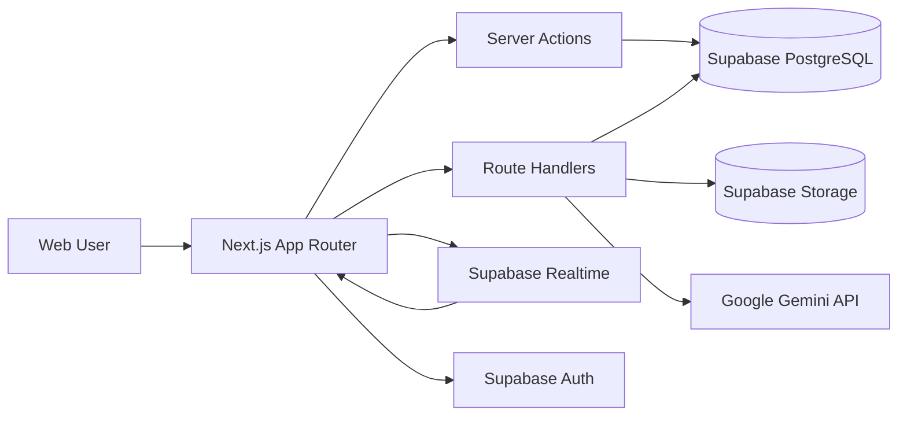

# Aphellium Platform v2.0

> Full-stack corporate web platform & internal operations system


---

## Overview

Aphellium Platform is a production-grade web application I designed and built from scratch for **Aphellium**, a technology and innovation company. The platform serves two strategic purposes:

- **Public-facing corporate site** — brand presence, news blog, project showcase, team profiles, and contact — all with full bilingual support (ES/EN).
- **Internal operations portal** — a secure admin dashboard for content management, task orchestration, real-time communication, video meetings, and AI-assisted workflows.

The entire system is deployed on **Vercel** and powered by **Supabase** as the backend platform.

---

## Tech Stack

| Layer | Technologies |
|-------|-------------|
| **Frontend / SSR** | Next.js 16 (App Router), React 19, TypeScript 5 |
| **Styling** | Tailwind CSS 4, Framer Motion, Lucide React |
| **Backend** | Supabase (Auth, PostgreSQL, Storage, Realtime) |
| **AI Integration** | Google Gemini API |
| **Deployment** | Vercel (Edge + Serverless) |
| **Patterns** | Server Actions, Route Handlers, RBAC, RLS |

---

## Features

### Public Corporate Site

- **Immersive Homepage** — Hero video background, animated statistics, team carousel, latest news feed, and project showcase with parallax effects.
- **News Blog** — Dynamic article pages with rich HTML rendering, social embeds, categorization, and SEO-optimized metadata.
- **Project Portfolio** — Blog-style detail pages with hero images, metrics sidebar, image gallery, related projects, and call-to-action sections.
- **Team & About** — Dedicated pages with member profiles, role descriptions, and company story.
- **Contact** — Functional contact form with server-side processing.
- **Bilingual (ES/EN)** — Full internationalization with language switcher and server-side locale detection.

### Admin Portal (Secure)

- **Dashboard** — Personalized welcome, clickable stat cards with real-time data, quick access links, animated notification badges.
- **Content Management** — Full CRUD for news articles and projects with rich text editor, image uploads, featured toggles, and publication diagnostics.
- **User & Role Management** — Account creation, RBAC role assignment (admin, coordinator, editor, viewer), drag & drop team ordering.
- **Task Orchestration** — Task lifecycle management (pending, in-progress, completed, cancelled, deferred), assignments with acceptance gates, threaded comments, file attachments, and activity timeline.
- **Real-time Chat** — Direct 1:1 messaging, manual group rooms, auto-generated task-linked rooms, and customer support chat.
- **Video Meetings (WebRTC)** — Peer-to-peer video conferencing with meeting room creation, real-time invitations, and session management.
- **AI Assistant** — Company knowledge base with document imports, powered by Google Gemini for context-aware conversational AI.
- **Site Settings** — Platform-wide configuration panel for branding, SEO, and operational parameters.

### Design System

- Unified dark theme with custom CSS properties (`--accent-cyan`, `--accent-green`)
- Consistent component library: subtle borders (`white/[0.06]`), glass backgrounds (`white/[0.02]`), hover transitions
- Fully responsive — mobile-first with bottom navigation, horizontal pills, and adaptive layouts

---

## Architecture



### Key Architecture Decisions

| Decision | Rationale |
|----------|-----------|
| **Next.js App Router** | Unified SSR + server-side business logic in a single framework |
| **Supabase** | Consolidates Auth, Postgres, Storage, and Realtime — reducing infrastructure complexity |
| **RBAC + RLS** | Least-privilege enforcement at both application and database layers |
| **Server Actions** | Type-safe server mutations without API boilerplate |
| **WebRTC** | Peer-to-peer video calls minimize latency and server costs |
| **Google Gemini** | AI-assisted chat with company knowledge base context |

---

## Security Model

- **Role-Based Access Control (RBAC)** — Five roles with granular permissions: admin, coordinator, editor, viewer, visitor
- **Row-Level Security (RLS)** — Database-enforced access policies on all operational tables
- **Server-side Authorization** — All sensitive operations validated on the server before execution
- **HTML Sanitization** — DOMPurify for all user-generated rendered content
- **Environment Isolation** — All credentials managed via environment variables, excluded from version control

---

## Database Schema

The platform uses **12 incremental SQL migrations** covering:

- Chat messaging system (direct + group rooms)
- Task management with assignments, comments, and attachments
- RLS policy optimization
- Group chat with task-gate collaboration
- Customer support and knowledge base
- Meeting rooms and WebRTC signaling
- Real-time invitation system
- Team ordering and profile sections

---

## Project Structure

```
app/
├── (main)/          # Public site routes (home, news, projects, about, contact)
├── admin/           # Protected admin portal
│   └── (portal)/    # Dashboard, news, projects, messages, users, settings
├── api/             # REST API routes
├── auth/            # Auth callbacks
└── actions/         # Server actions

components/          # Reusable UI components (Navbar, Footer, ChatWidget, etc.)
hooks/               # Custom hooks (WebRTC, meeting sounds)
migrations/          # Incremental SQL migrations (001-011)
utils/               # Auth, i18n, roles, translations, Supabase clients
```

---

## Running Locally

```bash
# Install dependencies
npm install

# Set up environment variables
cp .env.example .env.local
# Fill in your Supabase and Gemini credentials

# Start development server
npm run dev

# Production build
npm run build && npm start
```

---

## Author

Built by **[@MrBinary15](https://github.com/MrBinary15)** as part of the Aphellium technology initiative.

---

*This repository is a portfolio showcase of the Aphellium Platform codebase. The production deployment is private.*
