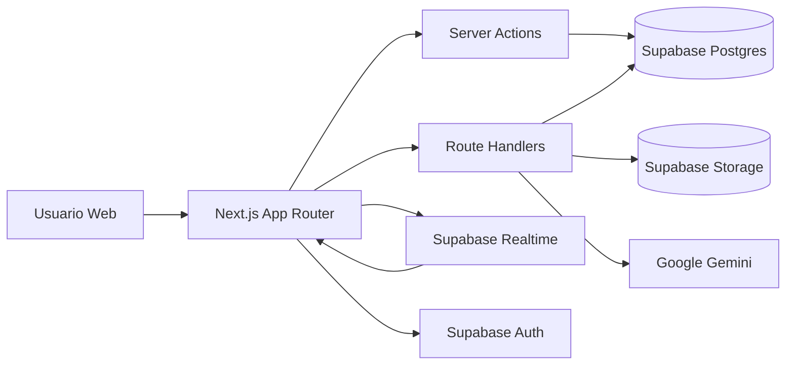
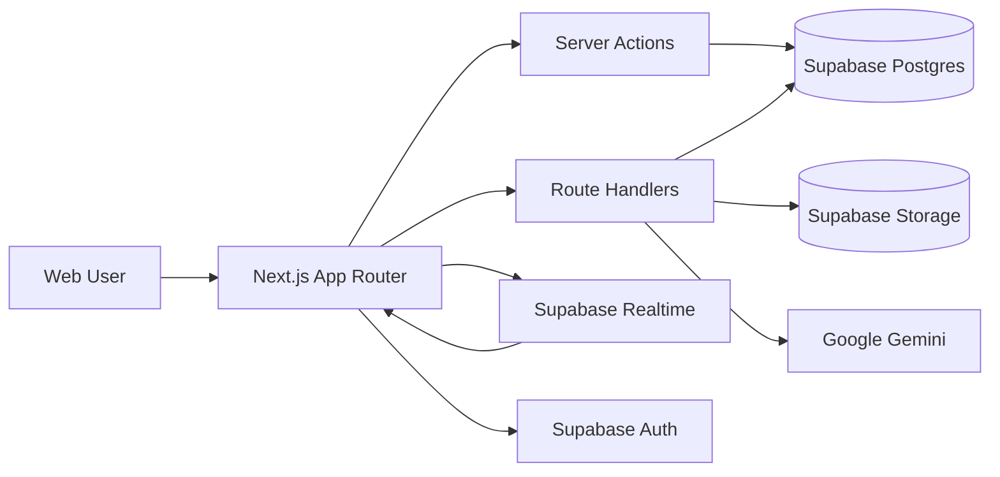

# Aphellium Platform v2.0


---

## Sobre Aphellium

**Aphellium** es una empresa de tecnología e innovación enfocada en el desarrollo de soluciones digitales de alto impacto. Nuestra misión es transformar ideas en productos tecnológicos de clase mundial, combinando ingeniería de software avanzada, diseño centrado en el usuario y estrategia empresarial.

Operamos en múltiples verticales — desde plataformas web corporativas hasta sistemas operativos internos — siempre bajo principios de seguridad, escalabilidad y excelencia técnica. Nuestro equipo multidisciplinario trabaja con metodologías ágiles y herramientas de última generación para entregar resultados medibles.

**Aphellium Platform** es nuestra plataforma interna y pública, que unifica la presencia digital de la empresa con las herramientas operativas del equipo en un solo sistema.

---

## Table of Contents

- [Sobre Aphellium](#sobre-aphellium)
- [ES - Plataforma Aphellium](#es---plataforma-aphellium)
  - [Descripción Ejecutiva](#descripción-ejecutiva)
  - [Novedades v2.0](#novedades-v20)
  - [Capacidades de Negocio](#capacidades-de-negocio)
  - [Arquitectura Técnica](#arquitectura-técnica)
  - [Diagrama de Arquitectura](#diagrama-de-arquitectura)
  - [Modelo de Seguridad](#modelo-de-seguridad)
  - [Operación y Despliegue](#operación-y-despliegue)
  - [Variables de Entorno](#variables-de-entorno)
  - [Migraciones](#migraciones)
- [EN - Aphellium Platform](#en---aphellium-platform)
  - [Executive Summary](#executive-summary)
  - [What's New in v2.0](#whats-new-in-v20)
  - [Business Capabilities](#business-capabilities)
  - [Technical Architecture](#technical-architecture)
  - [Architecture Diagram](#architecture-diagram)
  - [Security Model](#security-model)
  - [Operations and Deployment](#operations-and-deployment)
  - [Environment Variables](#environment-variables)
  - [Migrations](#migrations)
- [ADR - Architecture Decision Records](#adr---architecture-decision-records)

---

## ES - Plataforma Aphellium

### Descripción Ejecutiva

Aphellium Platform es una solución web integral orientada a dos frentes:

- **Canal público corporativo** para marca, storytelling, noticias y proyectos.
- **Canal interno operativo** para gestión de usuarios, tareas, reuniones y comunicación colaborativa.

La plataforma prioriza seguridad, trazabilidad y gobernanza de acceso mediante RBAC y políticas RLS en base de datos.

### Novedades v2.0

**Portal Administrativo — Rediseño Completo UX/UI**

- **Nuevo Layout del Portal**: Sidebar con navegación agrupada por secciones (Principal, Equipo, Cuenta, Administración), badges de rol, enlace al sitio público, y navegación mobile mejorada con bottom nav y pills horizontales.
- **Dashboard Rediseñado**: Tarjetas de estadísticas clicables con hover gradients, saludo personalizado, indicador animado de mensajes nuevos, acceso rápido compacto y enlaces al sitio público.
- **Páginas de Noticias y Proyectos**: Tablas profesionales con headers uppercase, columnas responsive que se ocultan en mobile, diagnóstico de publicaciones mejorado con cards compactas.
- **Centro de Mensajes**: Tabs refinadas (Correos / Soporte Chat), búsqueda mejorada, cards de mensaje con bordes sutiles y transiciones.
- **Gestión de Usuarios**: Formulario de creación renovado, tabla de cuentas con drag & drop para orden del equipo, badges de rol consistentes.
- **Configuración**: Formulario limpio con inputs oscuros, secciones organizadas y botones de acción prominentes.
- **Design System Unificado**: Bordes `white/[0.06]`, fondos `white/[0.02]`, inputs con `white/[0.03]`, hover states `white/[0.04]`, tipografía compacta y colores de acento consistentes (cyan/green).

**Páginas de Proyectos Públicas**

- **Página de Detalle Individual**: Nueva página blog-style `/proyectos/[id]` con hero, métricas, contenido HTML renderizado, galería, sidebar sticky, proyectos relacionados y CTA.
- **Navegación desde Homepage**: Cards de proyectos en la home ahora enlazan directamente a la página de detalle individual.
- **Grid de Proyectos**: Botones "Ver Proyecto" que navegan a la vista detallada.

**Correcciones**

- Texto de dropdowns/selects ahora visible (letras negras sobre fondo blanco).
- Botón toggle "Proyecto Destacado" corregido — el knob ya no se desborda.

### Capacidades de Negocio

1. **Presencia corporativa digital**
   - Home, nosotros, noticias, proyectos y contacto.
   - Experiencia visual multimedia y contenido bilingüe (ES/EN).
   - Páginas de detalle individual para noticias y proyectos (blog-style).

2. **Gestión administrativa**
   - Operación editorial de noticias/proyectos con editor de texto enriquecido.
   - Gestión de cuentas, roles y orden de presentación del equipo.
   - Configuración del sitio y perfil de usuario.
   - Diagnóstico de publicaciones (traducciones, enlaces, embeds).

3. **Planificación operativa**
   - Ciclo de vida de tareas: pendiente, en progreso, completada, cancelada, postergada.
   - Asignaciones, confirmación de participación, comentarios y adjuntos.
   - Registro de actividad para auditoría operacional.

4. **Reuniones y videollamadas**
   - Creación de salas de reunión con metadatos.
   - Invitaciones en tiempo real.
   - Sistema WebRTC para videollamadas peer-to-peer.

5. **Comunicación interna en tiempo real**
   - Chat directo 1:1.
   - Grupos manuales (admin/coordinador).
   - Grupos de tarea autogenerados tras aceptación.
   - Soporte al cliente con chat en vivo.

6. **Inteligencia Artificial**
   - Base de conocimiento con documentos importados.
   - Chat asistido por IA (Gemini) con contexto de la empresa.

### Arquitectura Técnica

- **Frontend/SSR**: Next.js 16, React 19, TypeScript.
- **UI/UX**: Tailwind CSS 4, framer-motion, lucide-react.
- **Backend platform**: Supabase (Auth, Postgres, Storage, Realtime).
- **IA**: Google Gemini API para chat asistido.
- **Patrones de backend**:
  - Server Actions para mutaciones de negocio.
  - Route Handlers para APIs específicas.
  - Utilidades centralizadas en capa `utils/` para auth/roles/i18n/clientes.

**Dominios principales:**

| Dominio | Módulos |
|---------|---------|
| Contenido | Noticias, Proyectos, Editor Enriquecido |
| Operaciones | Tareas, Asignaciones, Comentarios, Adjuntos, Actividad |
| Comunicación | Chat Directo, Salas, Soporte, Videollamadas |
| Identidad | Auth, Perfil, Roles, Permisos (RBAC) |
| IA | Base de Conocimiento, Chat Gemini |

### Diagrama de Arquitectura



### Modelo de Seguridad

- **RBAC** por rol: admin, coordinador, editor, viewer, visitante.
- Autorización obligatoria en acciones sensibles de servidor.
- **RLS** habilitado en tablas operativas y de colaboración.
- Uso de service role únicamente en contexto server-side controlado.
- Variables sensibles excluidas del control de versiones.
- Sanitización HTML con DOMPurify para contenido renderizado.

### Operación y Despliegue

Desarrollo local:

```bash
npm install
npm run dev
```

Build y ejecución:

```bash
npm run build
npm run start
```

Despliegue recomendado: **Vercel**.

**Checklist de salida a producción:**

- [ ] Variables de entorno completas y validadas.
- [ ] Migraciones SQL aplicadas en orden.
- [ ] Buckets/políticas de storage verificadas.
- [ ] Pruebas de permisos por rol y RLS.

### Variables de Entorno

**Requeridas:**

| Variable | Descripción |
|----------|-------------|
| `NEXT_PUBLIC_SUPABASE_URL` | URL del proyecto Supabase |
| `NEXT_PUBLIC_SUPABASE_ANON_KEY` | Clave pública anon de Supabase |
| `SUPABASE_SERVICE_ROLE_KEY` | Clave de service role (server-side) |

**Opcionales:**

| Variable | Descripción |
|----------|-------------|
| `TRANSLATE_API_URL` | Endpoint de traducción automática |
| `DATABASE_URL` | Conexión directa a Postgres |
| `GEMINI_API_KEY` | API key de Google Gemini |

### Migraciones

Ejecutar en orden:

1. `migrations/001_chat_messages.sql`
2. `migrations/002_tasks_system.sql`
3. `migrations/003_fix_rls_recursion.sql`
4. `migrations/004_group_chat_and_task_gate.sql`
5. `migrations/004_support_and_knowledge.sql`
6. `migrations/005_backfill_group_chat_tables.sql`
7. `migrations/006_meetings_system.sql`
8. `migrations/007_webrtc_signals.sql`
9. `migrations/008_meeting_invitations_realtime.sql`
10. `migrations/009_profiles_team_order.sql`
11. `migrations/010_profiles_team_section.sql`
12. `migrations/011_meeting_enhancements.sql`

---

## EN - Aphellium Platform

### Executive Summary

Aphellium Platform is a full-stack web solution designed for two strategic channels:

- **Public-facing** brand and content experience.
- **Internal operations** workspace for administration, task orchestration, meetings, and communication.

The platform is designed around secure-by-default principles using RBAC and database-level RLS enforcement.

### What's New in v2.0

**Admin Portal — Complete UX/UI Redesign**

- **New Portal Layout**: Sidebar with grouped navigation (Main, Team, Account, Administration), role badges, public site link, and improved mobile navigation with bottom nav and horizontal pills.
- **Redesigned Dashboard**: Clickable stat cards with hover gradients, personalized greeting, animated new messages indicator, compact quick access and public site links.
- **News & Projects Pages**: Professional tables with uppercase headers, responsive columns that hide on mobile, improved publication diagnostics with compact cards.
- **Messages Center**: Refined tabs (Emails / Support Chat), improved search, message cards with subtle borders and transitions.
- **User Management**: Renewed creation form, accounts table with drag & drop for team ordering, consistent role badges.
- **Settings**: Clean form with dark inputs, organized sections, and prominent action buttons.
- **Unified Design System**: Borders `white/[0.06]`, backgrounds `white/[0.02]`, inputs `white/[0.03]`, hover states `white/[0.04]`, compact typography and consistent accent colors (cyan/green).

**Public Project Pages**

- **Individual Detail Page**: New blog-style `/proyectos/[id]` page with hero, metrics, rendered HTML content, gallery, sticky sidebar, related projects, and CTA.
- **Homepage Navigation**: Project cards on the homepage now link directly to individual detail pages.
- **Projects Grid**: "View Project" buttons navigating to the detail view.

**Bug Fixes**

- Dropdown/select text now visible (black text on white background).
- "Featured Project" toggle button fixed — knob no longer overflows.

### Business Capabilities

1. **Corporate digital presence**
   - Public pages for brand, team, news, projects, and contact.
   - Bilingual content support (ES/EN) and media-driven UX.
   - Individual detail pages for news and projects (blog-style).

2. **Administrative operations**
   - News and project lifecycle management with rich text editor.
   - User and role administration with team ordering.
   - Profile and platform settings workflows.
   - Publication diagnostics (translations, links, embeds).

3. **Task orchestration**
   - Task lifecycle management with priorities and due dates.
   - Assignment, acceptance confirmation, threaded collaboration.
   - Attachments and activity timeline for operational traceability.

4. **Meetings & video calls**
   - Meeting room creation with metadata.
   - Real-time invitations.
   - WebRTC system for peer-to-peer video calls.

5. **Real-time internal communication**
   - 1:1 direct messaging.
   - Manual group rooms (admin/coordinator).
   - Auto-linked task rooms after assignment acceptance.
   - Customer support with live chat.

6. **Artificial Intelligence**
   - Knowledge base with imported documents.
   - AI-assisted chat (Gemini) with company context.

### Technical Architecture

- **Frontend/SSR**: Next.js 16, React 19, TypeScript.
- **UI/UX**: Tailwind CSS 4, framer-motion, lucide-react.
- **Backend platform**: Supabase (Auth, Postgres, Storage, Realtime).
- **AI**: Google Gemini API for assisted chat.
- **Backend patterns**:
  - Server Actions for domain mutations.
  - Route Handlers for scoped backend APIs.
  - Centralized utility layer in `utils/` for auth/roles/i18n/clients.

**Primary domains:**

| Domain | Modules |
|--------|---------|
| Content | News, Projects, Rich Text Editor |
| Operations | Tasks, Assignments, Comments, Attachments, Activity |
| Communication | Direct Chat, Rooms, Support, Video Calls |
| Identity | Auth, Profile, Role Governance (RBAC) |
| AI | Knowledge Base, Gemini Chat |

### Architecture Diagram



### Security Model

- **RBAC** governance across domains: admin, coordinator, editor, viewer, visitor.
- Server-side authorization for sensitive operations.
- **RLS**-enabled operational and collaboration tables.
- Service-role credentials only in trusted server contexts.
- Sensitive configuration excluded from version control.
- HTML sanitization with DOMPurify for rendered content.

### Operations and Deployment

Local development:

```bash
npm install
npm run dev
```

Production build:

```bash
npm run build
npm run start
```

Recommended hosting: **Vercel**.

**Production readiness checklist:**

- [ ] Environment configuration validated.
- [ ] SQL migrations applied in sequence.
- [ ] Storage buckets/policies verified.
- [ ] RBAC and RLS behavior validated.

### Environment Variables

**Required:**

| Variable | Description |
|----------|-------------|
| `NEXT_PUBLIC_SUPABASE_URL` | Supabase project URL |
| `NEXT_PUBLIC_SUPABASE_ANON_KEY` | Supabase public anon key |
| `SUPABASE_SERVICE_ROLE_KEY` | Service role key (server-side) |

**Optional:**

| Variable | Description |
|----------|-------------|
| `TRANSLATE_API_URL` | Auto-translation endpoint |
| `DATABASE_URL` | Direct Postgres connection |
| `GEMINI_API_KEY` | Google Gemini API key |

### Migrations

Run in order:

1. `migrations/001_chat_messages.sql`
2. `migrations/002_tasks_system.sql`
3. `migrations/003_fix_rls_recursion.sql`
4. `migrations/004_group_chat_and_task_gate.sql`
5. `migrations/004_support_and_knowledge.sql`
6. `migrations/005_backfill_group_chat_tables.sql`
7. `migrations/006_meetings_system.sql`
8. `migrations/007_webrtc_signals.sql`
9. `migrations/008_meeting_invitations_realtime.sql`
10. `migrations/009_profiles_team_order.sql`
11. `migrations/010_profiles_team_section.sql`
12. `migrations/011_meeting_enhancements.sql`

---

## ADR - Architecture Decision Records

**ADR-001**: Next.js App Router selected for unified SSR + server-side business logic.

**ADR-002**: Supabase chosen as backend platform to consolidate Auth, Postgres, Storage, and Realtime.

**ADR-003**: RBAC + RLS adopted to enforce least privilege at both application and data layers.

**ADR-004**: Task collaboration is acceptance-gated to prevent unauthorized interaction in operational workflows.

**ADR-005**: Group chat model supports both manual rooms and task-linked automatic rooms for operational coordination.

**ADR-006**: WebRTC selected for peer-to-peer video calls to minimize latency and server costs.

**ADR-007**: Google Gemini integrated for AI-assisted chat with knowledge base context.
